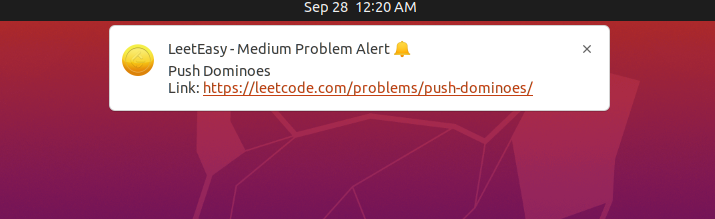

# LeetEasy

<br/>
<br/>
Desktop notification for easy daily challenges in [leetcode](https://leetcode.com/).

We all know `Leetcode's` daily challenges are awesome :sunglasses: However, sometimes these challenges are quite difficult for people who are just starting out problem-solving 	:smiling_face_with_tear:  
This tool will send desktop notification when an **Easy** daily problem is published. This way you won't miss any opportunity to grab some easy **Leetcoins** :coin: and stay motivated for the day :fire:

## Requirements
- python >= 3.8
## Installation
```shell
pip install leeteasy
```
## run
Schedule leeteasy to send notification for easy leetcode problem at 14:30 (24 hours format time)
```shell
python -m leeteasy start 14:30 &
```
To add additional difficulty

```shell
python -m leeteasy start 14:30 --difficulty medium &
```
This will schedule leeteasy for **Easy and Medium** problem.
<br/>
<br/>
To stop leeteasy
```shell
python -m leeteasy stop
```
> **_NOTE:_**  By default `leeteasy` checks for scheduled task in every 1 hour/3600 seconds.
> So there might be 1-hour delay from the actual scheduled time while getting the notification. However,
> this can be controlled using `--sleep_duration` option.

## Linux cronjob guide
Set a cronjob to automatically start `leeteasy` at system boot.
```shell
# open cronjob editor
crontab -e

# add the following line
@reboot python -m leeteasy start 14:30 &

```
## Contribution guideline

If you like this project and want to improve by adding features, fixing bugs or anything, please follow
the [contributing guidelines](docs/CONTRIBUTING.md).